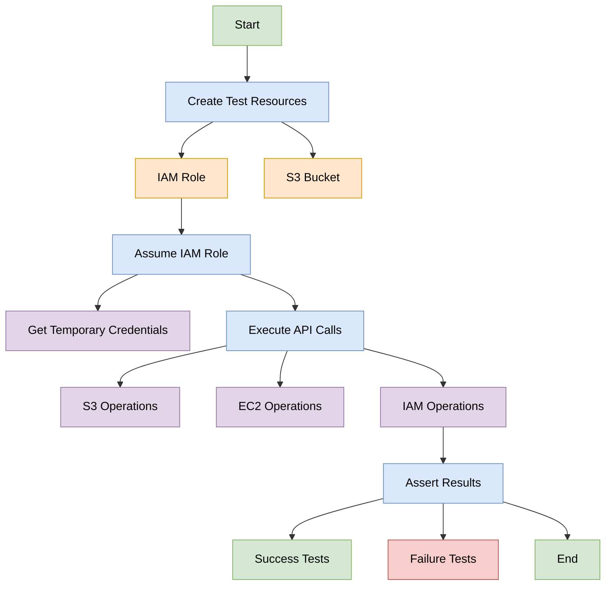

# IAM Smoke Testing Workflow

## Process Flow Description

1. **Start**: Begin the smoke test process

2. **Create Test Resources**:
   - Create an IAM role with necessary permissions
   - Optionally apply a permission boundary
   - Create an S3 bucket for testing

3. **Assume IAM Role**:
   - Use AWS STS to assume the test role
   - Obtain temporary security credentials

4. **Execute API Calls**:
   - Perform operations against various AWS services:
     - S3 operations (list bucket, get object)
     - EC2 operations (describe instances)
     - IAM operations (list roles)

5. **Assert Results**:
   - For success tests: verify the operation succeeded
   - For failure tests: verify the operation was denied

6. **End**: Complete the smoke test process
